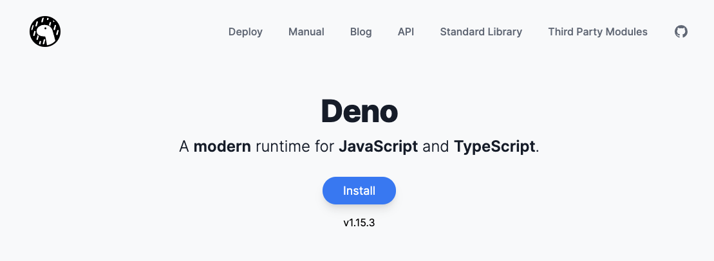

# README

The code in this repository helps with setting walking goals using a Fitbit
device. Data obtained from the Fitbit API is downloaded to a folder called
`data`; once downloaded, the data is used to count how many active steps the
user has done each day and to set daily and weekly active step goals.

This project uses [Deno](https://deno.land/) and
[TypeScript](https://www.typescriptlang.org/).

## Installation

1. Install Deno by going to the [Deno website](https://deno.land/) and following
   the instructions. It should be one command to install Deno.
   
1. Open a terminal (Windows PowerShell on Windows), create a directory where you
   want, and go into it.
   ```bash
   mkdir fitbit-goal-setter
   cd fitbit-goal-setter
   ```
1. Next let's make an executable for the program on your computer.
   ```bash
   deno compile --allow-read --allow-write --allow-net --reload https://raw.githubusercontent.com/audrow/fitbit-goal-setter/deploy/build/fitbit-goal-setter.js
   ```
   Now you have my program in an executable file! You can test that the program
   works by running
   ```bash
   # For windows
   .\fitbit-goal-setter.exe --help
   # For ubuntu/mac
   ./fitbit-goal-setter --help
   ```
   which will output something like the following:
   ```bash
   deno run <command>

   Commands:
     deno run list-devices               List all devices
     deno run test-api-keys              Test API keys
     deno run goal-status                Get goal status
     deno run pull-data                  Pull data from the Fitbit API
     deno run call-fitbit-api [request]  Make your own call to the fitbit API for a
                                         ll devices
     deno run make-config-file           Make a config file. This doesn't overwrite
                                         existing config files, so if you want to
                                         make another config file, delete or rename
                                         the existing one.

   Options:
     -h, --help     Show help                                             [boolean]
     -v, --version  Show version number                                   [boolean]
   ```
   Note that each command begins with `deno run <command>`, this is a quirk of
   the library that I'm using for the command line interface. It should say
   `.\fitbit-goal-setter.exe <command>` on Windows and
   `./fitbit-goal-setter <command>` on Linux/macOS.

   Also, note that we haven't set up our config file, so you won't be able to
   run most of the commands yet.

1. Now let's create a configuration file. This is how you'll set various aspects
   of the system up, such as how you define active steps, the Fitbit API
   credentials, the study and intervention dates, etc.
   ```bash
   # For windows
   .\fitbit-goal-setter.exe make-config-file
   # For ubuntu/mac
   ./fitbit-goal-setter make-config-file
   ```
   You should see the following output:
   ```bash
   Created config file: config.yaml
   ```
1. Now we need to edit the configuration file. You can open the file in any text
   editor, for example on Windows you can use notepad:
   ```bash
   # For windows
   notepad.exe .\config.yaml
   ```
   The config file has several comments in it. The main thing is that you must
   have at least one Fitbit access token. For instructions on getting the Fitbit
   access token see [here](./docs/getting-fitbit-access-token.md).

   You also will want to set the study and intervention dates, as well as the
   duration of the study in weeks.

1. Once you have the configuration file setup, you can check the API keys to see
   if they are correct before proceeding. This command will check if you're able
   to connect to the Fitbit API at all and if you have access to the intraday
   steps. Both of these checks are necessary before you can run the rest of the
   commands.
   ```bash
   # For windows
   .\fitbit-goal-setter.exe test-api-keys
   # For ubuntu/mac
   ./fitbit-goal-setter test-api-keys
   ```
   If this was not successful, make sure that you're using the right access
   token and that you have the right permissions to access the Fitbit intra
   process data. Make sure you've done everything correct in
   [this page](./docs/getting-fitbit-access-token.md).

Now you're setup! The main command that you'll be using is `goal-status`, which
prints information on the status of all devices in the configuration file.

```bash
# For windows
   .\fitbit-goal-setter.exe goal-status
   # For ubuntu/mac
   ./fitbit-goal-setter goal-status
```

All of the data generated from the Fitbit API as well as a summary of each days
results is stored in a folder called `data` that will be created for you when
you run `goal-status` or `pull-data` (`pull-data` is run automatically when you
run `goal-status`).
